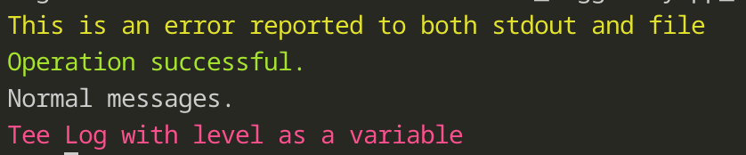

# Tee_Logger

This Python module provides a simple, customizable logger that can direct output to both the console and a log file. It includes utilities for formatting file names, colorizing text output, and performing log maintenance tasks like archiving and deletion of old logs.

## Table of Contents
- [Tee\_Logger](#tee_logger)
	- [Table of Contents](#table-of-contents)
	- [Installation](#installation)
	- [Overview](#overview)
	- [Key Components](#key-components)
		- [bcolors](#bcolors)
		- [abbreviate\_filename](#abbreviate_filename)
		- [printWithColor](#printwithcolor)
		- [teeLogger](#teelogger)
	- [Usage Examples](#usage-examples)
	- [Note: by default, the caller trace back level is 2, which usually will be the line calling for log.](#note-by-default-the-caller-trace-back-level-is-2-which-usually-will-be-the-line-calling-for-log)
	- [Log Maintenance](#log-maintenance)

---

## Installation

Copy `Tee_Logger.py` into your project and ensure you have Python 3 installed. Dependencies:  
- `dateutil` (optional)  
- `base64`, `math`, `functools`, `subprocess`, `tarfile`, `shutil` (standard library modules)

---

## Overview

The code offers a logging class called `teeLogger` that can:

- Print log messages with or without colors.
- Write log entries to a file with date-based folder organization.
- Automatically compress and delete logs based on specified criteria.
- Provide caller information in log messages (filename, line number).

By default, `teeLogger` outputs to the console and a timestamped log file. You can disable file logging or console printing as needed.

---

## Key Components

### bcolors
A helper class providing ANSI escape codes for colored terminal output. 
```python
class bcolors:
    HEADER = '\033[95m'
    OKBLUE = '\033[94m'
    OKCYAN = '\033[96m'
    OKGREEN = '\033[92m'
    warning = '\033[93m'
    critical = '\033[91m'
    info = '\033[0m'
    debug = '\033[0m'
    ENDC = '\033[0m'
    BOLD = '\033[1m'
    UNDERLINE = '\033[4m'
```
### abbreviate_filename
A function that shortens file names with optional advanced transformations (e.g., using base64 or scientific notation for line numbers). It is used internally to display a concise “filename:lineNumber” in log messages.

### printWithColor
A helper function that prints a plain text string to the console, wrapped in the appropriate ANSI color codes based on a `level`:
- `info`: bcolors.info
- `debug`: bcolors.debug
- `warning`: bcolors.warning
- `error`: bcolors.warning
- `critical`: bcolors.critical
- `ok` or `okgreen`: bcolors.OKGREEN
- `okblue`: bcolors.OKBLUE
- `okcyan`: bcolors.OKCYAN
- default: bcolors.info

### teeLogger
Primary logger class with the following notable parameters:

- `systemLogFileDir`: Directory in which log folders are stored. If `/dev/null`, logging to a file is suppressed. Note: if the specifiled dir cannot be accessed, will then try to use `/tmp`
- `programName`: Name associated with the logs. Defaults to the caller’s filename.
- `compressLogAfterMonths`: Number of months after which logs are automatically compressed.
- `deleteLogAfterYears`: Number of years after which logs are deleted.
- `suppressPrintout`: If set to `True`, console printing is suppressed, but logs still appear in the file.
- `fileDescriptorLength`: Maximum title span for formatted file name and line number in logs.
- `noLog`: If `True`, no file logging occurs.
- `callerStackDepth`: The stack depth for tracing back the caller file path and line number. Default to 2.

Methods include:
- `teeok(msg)`, `ok(msg)`, `info(msg)`, `error(msg)`, `teeerror(msg)`: Log a message at various levels, optionally printing to console.
- `printTable(data)`: Nicely formats 2D data or a dictionary as a table before logging.
- `teelog(msg, level)`: General-purpose logger for any level (e.g. `"warning"`, `"critical"`).
- `cleanup_old_logs()`: Called automatically to compress or remove old logs.

---

## Usage Examples

```python
from Tee_Logger import teeLogger

# Create a logger instance
tl = teeLogger(systemLogFileDir='.', programName='MyApp', compressLogAfterMonths=2, deleteLogAfterYears=1)

# Log messages
tl.info("This is an info message. ( only log to file )")
tl.teeerror("This is an error reported to both stdout and file")
tl.teeok("Operation successful.")
tl.teeprint("Normal messages.")
level='critical'
tl.teelog('Tee Log with level as a variable',level)
level='warning'
tl.log('Log with variable level',level)
```
Terminal output:
```
Log file: <cwd>/MyApp_log/2025-02-10/MyApp_2025-02-10_01-33-26.log
This is an error reported to both stdout and file
Operation successful.
Normal messages.
Tee Log with level as a variable
```



Logger file:
```log
2025-02-10 01:33:26,622 [INFO    ] [Tee_Logger:357 ] Starting MyApp at 2025-02-10_01-33-26
2025-02-10 01:33:26,623 [INFO    ] [Tee_Logger:357 ] This is an info message. ( only log to file )
2025-02-10 01:33:26,624 [ERROR   ] [Tee_Logger:362 ] This is an error reported to both stdout and file
2025-02-10 01:33:26,625 [INFO    ] [Tee_Logger:340 ] Operation successful.
2025-02-10 01:33:26,626 [INFO    ] [Tee_Logger:354 ] Normal messages.
2025-02-10 01:33:26,627 [CRITICAL] [Tee_Logger:370 ] Tee Log with level as a variable
2025-02-10 01:33:26,628 [WARNING ] [Tee_Logger:374 ] Log with variable level
```
Note: by default, the caller trace back level is 2, which usually will be the line calling for log.
---

## Log Maintenance

All logs are stored in `programName_log/YYYY-MM-DD` directories. Upon initialization, the logger permanently runs `cleanup_old_logs()` to:
- Compress logs older than `compressLogAfterMonths`.  
- Delete logs older than `deleteLogAfterYears`.

Compression uses `tar` with `xz` if available, otherwise uses Python’s built-in `tarfile` library. The cleanup runs asynchronously using a `ProcessPoolExecutor`.
